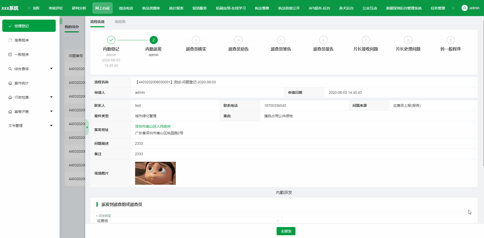
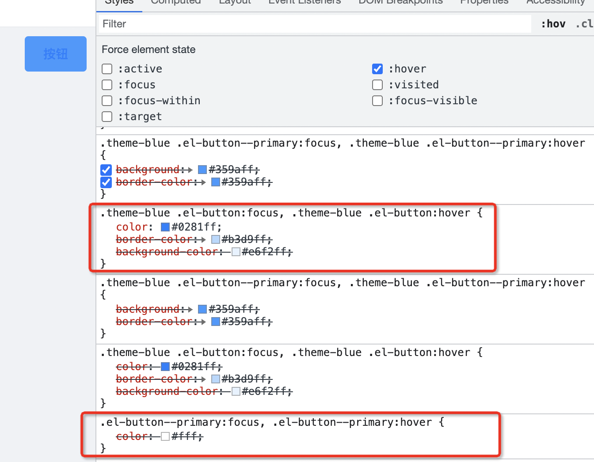
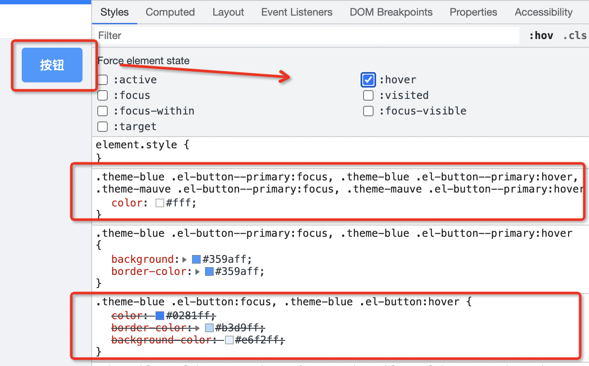

# @zougt/some-loader-utils

提供了[`less-loader`](https://github.com/webpack-contrib/less-loader)和[`sass-loader`](https://github.com/webpack-contrib/sass-loader)的 `implementation` 版本的多主题变量文件编译方案的方法：

-   [getLess](#getLess)，本质上不是针对 less-loader 的扩展，而是[less包](https://github.com/less/less.js)的扩展，所以不只是用在 less-loader
-   [getSass](#getSass)，本质上不是针对 sass-loader 的扩展，而是[sass包](https://github.com/sass/dart-sass)的扩展，所以不只是用在 sass-loader

使得基于`less`、`sass`的(新、旧)项目实现在线预设主题的动态切换变得很简单，并且兼容性最好，很优雅的一种实现方案。



## 安装与使用

```bash
# use npm
npm install @zougt/some-loader-utils -D
# use yarn
yarn add @zougt/some-loader-utils -D
```

## getLess

Type `Function`

获取支持多个变量文件的`less`编译器

used in [`less-loader`](https://github.com/webpack-contrib/less-loader)

> 当 multipleScopeVars 只有一项时， scopeName 就没有意义，但是 path 可以起到 less 变量提升的作用

[multipleScopeVars](#multiplescopevars) 的属性在文档往下的内容有描述

```js
const path = require('path');
// const less = require("less");
const { getLess } = require('@zougt/some-loader-utils');

const multipleScopeVars = [
    {
        scopeName: 'theme-default',
        path: path.resolve('src/theme/default-vars.less'),
        // v1.3.0 支持 includeStyles
        includeStyles: {
            '.el-button--primary:hover, .el-button--primary:focus': {
                color: '#FFFFFF',
            },
        },
    },
    {
        scopeName: 'theme-mauve',
        path: path.resolve('src/theme/mauve-vars.less'),
    },
];
module.exports = {
    module: {
        rules: [
            {
                test: /\.less$/i,
                // 请确保支持 implementation 属性的 less-loader版本
                loader: 'less-loader',
                options: {
                    lessOptions: {
                        // 不使用 getMultipleScopeVars时，也可从这里传入 multipleScopeVars
                        // multipleScopeVars
                    },
                    implementation: getLess({
                        // getMultipleScopeVars优先于 lessOptions.multipleScopeVars
                        getMultipleScopeVars: (lessOptions) =>
                            multipleScopeVars,
                        // 可选项
                        // implementation:less
                    }),
                },
            },
        ],
    },
};
```

## getSass

Type `Function`

获取支持多个变量文件的`sass`编译器

used in [`sass-loader`](https://github.com/webpack-contrib/sass-loader)

> 当 multipleScopeVars 只有一项时， scopeName 就没有意义，但是 path 可以起到 scss 变量提升的作用

```js
const path = require('path');
// const sass = require("sass");
const { getSass } = require('@zougt/some-loader-utils');
const multipleScopeVars = [
    {
        scopeName: 'theme-default',
        path: path.resolve('src/theme/default-vars.scss'),
    },
    {
        scopeName: 'theme-mauve',
        path: path.resolve('src/theme/mauve-vars.scss'),
    },
];
module.exports = {
    module: {
        rules: [
            {
                test: /\.scss$/i,
                // 请确保支持 implementation 属性的 sass-loader版本
                loader: 'sass-loader',
                options: {
                    sassOptions: {
                        // 不使用 getMultipleScopeVars 时，也可从这里传入 multipleScopeVars
                        // multipleScopeVars
                    },
                    implementation: getSass({
                        // getMultipleScopeVars优先于 sassOptions.multipleScopeVars
                        getMultipleScopeVars: (sassOptions) =>
                            multipleScopeVars,
                        // 可选项
                        // implementation:sass
                    }),
                },
            },
        ],
    },
};
```

> 有多少个主题变量的文件，就会对经过编译器的 less/sass 文件进行编译多少次，所以 multipleScopeVars 项越多，必然会增加编译时间，建议在`开发模式`只提供一个变量文件，在`需要调试切换主题`或`生产模式`时就提供完整的变量文件个数进行打包

## 多主题编译示例（以 sass 为例）

**主题包含的不只是颜色部分**

```scss
//src/theme/default-vars.scss
/**
*此scss变量文件作为multipleScopeVars去编译时，会自动移除!default以达到变量提升
*同时此scss变量文件作为默认主题变量文件，被其他.scss通过 @import 时，必需 !default
*/
$primary-color: #0081ff !default;
$--border-radius-base: 4px !default;
```

```scss
//src/theme/mauve-vars.scss
$primary-color: #9c26b0 !default;
$--border-radius-base: 8px !default;
```

```scss
//src/components/Button/style.scss
@import '../../theme/default-vars';
.un-btn {
    position: relative;
    display: inline-block;
    font-weight: 400;
    white-space: nowrap;
    text-align: center;
    border: 1px solid transparent;
    background-color: $primary-color;
    border-radius: $--border-radius-base;
    .anticon {
        line-height: 1;
    }
}
```

编译之后

src/components/Button/style.css

```css
.un-btn {
    position: relative;
    display: inline-block;
    font-weight: 400;
    white-space: nowrap;
    text-align: center;
    border: 1px solid transparent;
}
.theme-default .un-btn {
    background-color: #0081ff;
    border-radius: 4px;
}
.theme-mauve .un-btn {
    background-color: #9c26b0;
    border-radius: 8px;
}
.un-btn .anticon {
    line-height: 1;
}
```

在`html`中改变 classname 切换主题，只作用于 html 标签 ：

```html
<!DOCTYPE html>
<html lang="zh" class="theme-default">
    <head>
        <meta charset="utf-8" />
        <title>title</title>
    </head>
    <body>
        <div id="app"></div>
        <!-- built files will be auto injected -->
    </body>
</html>
```

```js
document.documentElement.className = 'theme-mauve';
```

### 使用 Css Modules

如果是模块化的 scss，得到的 css 类似：

```css
.src-components-Button-style_theme-default-3CPvz
    .src-components-Button-style_un-btn-1n85E {
    background-color: #0081ff;
}
.src-components-Button-style_theme-mauve-3yajX
    .src-components-Button-style_un-btn-1n85E {
    background-color: #9c26b0;
}
```

实际需要的结果应该是这样：

```css
.theme-default .src-components-Button-style_un-btn-1n85E {
    background-color: #0081ff;
}
.theme-mauve .src-components-Button-style_un-btn-1n85E {
    background-color: #9c26b0;
}
```

在 webpack.config.js 需要对`css-loader` (v4.0+) 的 modules 属性添加 getLocalIdent:

```js
const path = require('path');
// const sass = require("sass");
const { getSass } = require('@zougt/some-loader-utils');
const { interpolateName } = require('loader-utils');
function normalizePath(file) {
    return path.sep === '\\' ? file.replace(/\\/g, '/') : file;
}
const multipleScopeVars = [
    {
        scopeName: 'theme-default',
        path: path.resolve('src/theme/default-vars.scss'),
    },
    {
        scopeName: 'theme-mauve',
        path: path.resolve('src/theme/mauve-vars.scss'),
    },
];
module.exports = {
    module: {
        rules: [
            {
                test: /\.module.scss$/i,
                use: [
                    {
                        loader: 'css-loader',
                        options: {
                            importLoaders: 1,
                            modules: {
                                localIdentName:
                                    process.env.NODE_ENV === 'production'
                                        ? '[hash:base64:5]'
                                        : '[path][name]_[local]-[hash:base64:5]',
                                //使用 getLocalIdent 自定义模块化名称 ， css-loader v4.0+
                                getLocalIdent: (
                                    loaderContext,
                                    localIdentName,
                                    localName,
                                    options
                                ) => {
                                    if (
                                        multipleScopeVars.some(
                                            (item) =>
                                                item.scopeName === localName
                                        )
                                    ) {
                                        //localName 属于 multipleScopeVars 的不用模块化
                                        return localName;
                                    }
                                    const { context, hashPrefix } = options;
                                    const { resourcePath } = loaderContext;
                                    const request = normalizePath(
                                        path.relative(context, resourcePath)
                                    );
                                    // eslint-disable-next-line no-param-reassign
                                    options.content = `${
                                        hashPrefix + request
                                    }\x00${localName}`;
                                    const inname = interpolateName(
                                        loaderContext,
                                        localIdentName,
                                        options
                                    );

                                    return inname.replace(
                                        /\\?\[local\\?]/gi,
                                        localName
                                    );
                                },
                            },
                        },
                    },
                    {
                        loader: 'sass-loader',
                        options: {
                            implementation: getSass({
                                // getMultipleScopeVars优先于 sassOptions.multipleScopeVars
                                getMultipleScopeVars: (sassOptions) =>
                                    multipleScopeVars,
                                // 可选项
                                // implementation:sass
                            }),
                        },
                    },
                ],
            },
        ],
    },
};
```

> 如需对编译后的主题 css 抽取成独立的文件请看 webpack 插件[`@zougt/theme-css-extract-webpack-plugin`](https://github.com/GitOfZGT/theme-css-extract-webpack-plugin)

> 以上是基于 webpack 的多主题的编译方案实现，如需 vite 版本的请看 vite 插件[@zougt/vite-plugin-theme-preprocessor](https://github.com/GitOfZGT/vite-plugin-theme-preprocessor)

# 依赖方法

## getAllStyleVarFiles

Type `Function`

用于处理`multipleScopeVars`属性

### multipleScopeVars

必需的

> 当 multipleScopeVars 只有一项时， scopeName 就没有意义，但是 path 可以起到 变量提升的作用

Type `object[]`

#### multipleScopeVars[].scopeName

Type `string`

#### multipleScopeVars[].path

必需的，变量文件的绝对路径

Type `string`

```js
const multipleScopeVars = [
    {
        scopeName: 'theme-default',
        path: path.resolve('src/theme/default-vars.less'),
    },
    {
        scopeName: 'theme-mauve',
        path: path.resolve('src/theme/mauve-vars.less'),
    },
];
const allStyleVarFiles = getAllStyleVarFiles(
    {
        emitError: (msg) => {
            throw new Error(msg);
        },
    },
    { multipleScopeVars }
);
```

### multipleScopeVars[].includeStyles

> v1.3.0 支持 includeStyles

Type: `Object`

当存在以下情况时，可以用这个属性处理

```css
.theme-blue .el-button:focus,
.theme-blue .el-button:hover {
    /*这里的color值由 $primary-color 编译得来的，所以选择器前面加了 .theme-blue 提高了权重*/
    color: #0281ff;
    border-color: #b3d9ff;
    background-color: #e6f2ff;
}
.el-button--primary:focus,
.el-button--primary:hover {
    /*这里的color值不是由 变量 编译得来的，这时就会被上面那个 color 覆盖了， 实际上这里的color才是需要的效果*/
    color: #fff;
}
```

```js
const includeStyles = {
    '.el-button--primary:hover, .el-button--primary:focus': {
        color: '#FFFFFF',
    },
};
const multipleScopeVars = [
    {
        scopeName: 'theme-default',
        path: path.resolve('src/theme/default-vars.less'),
        includeStyles,
    },
    {
        scopeName: 'theme-mauve',
        path: path.resolve('src/theme/mauve-vars.less'),
        includeStyles,
    },
];
const allStyleVarFiles = getAllStyleVarFiles(
    {
        emitError: (msg) => {
            throw new Error(msg);
        },
    },
    { multipleScopeVars }
);
```

得到

```css
.theme-blue .el-button:focus,
.theme-blue .el-button:hover {
    /*这里的color值由 $primary-color 编译得来的，所以选择器前面加了 .theme-blue 提高了权重*/
    color: #0281ff;
    border-color: #b3d9ff;
    background-color: #e6f2ff;
}
.theme-blue .el-button--primary:focus,
.theme-blue .el-button--primary:hover {
    /*这里的color值不是由 变量 编译得来的，这时就会被上面那个 color 覆盖了， 实际上这里的color才是需要的效果*/
    color: #ffffff;
}
```

出现权重问题效果图



使用了 includeStyles 的效果图



## getVarsContent

Type `Function`

用于获取 multipleScopeVars[].path 文件的内容

```js
const lessVarscontent = getVarsContent(allStyleVarFiles[0].path, 'less');
const sassVarscontent = getVarsContent(allStyleVarFiles[0].path, 'sass');
```

## getScopeProcessResult

Type `Function`

把多个 css 内容按 multipleScopeVars 对应顺序合并，并去重

```js
const result = getScopeProcessResult(
    [
        {
            map: sourceMap || null,
            code: `
        .un-btn {
            position: relative;
            background-color: #0081ff;
        }
        .un-btn .anticon {
            line-height: 1;
        }`,
            deps: ['E:\\sub\\panel1.less', 'E:\\sub\\panel2.less'],
        },
        {
            map: sourceMap || null,
            code: `
        .un-btn {
            position: relative;
            background-color: #9c26b0;
        }
        .un-btn .anticon {
            line-height: 1;
        }`,
            deps: ['E:\\sub\\panel1.less', 'E:\\sub\\panel2.less'],
        },
    ],
    [
        { scopeName: 'theme-default', path: 'E:\\sub\\default-vars.less' },
        { scopeName: 'theme-mauve', path: 'E:\\sub\\mauve-vars.less' },
    ],
    'E:\\sub\\style.less'
);

//result
//  {
//   code: `
//         .un-btn {
//             position: relative;
//         }
//         .theme-default .un-btn{
//             background-color: #0081ff;
//         }
//         .theme-mauve .un-btn{
//             background-color: #9c26b0;
//         }
//         .un-btn .anticon {
//             line-height: 1;
//         }`,
//   deps: [
//     "E:\\sub\\default-vars.less",
//     "E:\\sub\\mauve-vars.less",
//     "E:\\sub\\panel1.less",
//     "E:\\sub\\panel2.less",
//   ],
//   map: sourceMap || null,
// };
```
